# BMW Global Sales SQL Analysis

Tags: Automotive, Data Analytics, Market Strategy, Sales Analytics

Tools Used: EXCEL, SQL

Date: October 6, 2025 → October 15, 2025

Project Overview: This project analyzed BMW’s global sales data to understand which regions, models, and car features drive the most revenue. BMW needed clear insights on regional performance, popular models, fuel types, colors, and yearly trends to make better production, marketing, and sales decisions.
My task was to use SQL to uncover patterns in sales volume, revenue, and customer preferences. The insights help BMW focus on high-performing regions, prioritize top-selling models, track color and fuel trends, and plan strategies to boost growth worldwide.

Business problem/Problem Statement: BMW sells cars worldwide, but sales patterns vary by region, model, color, and fuel type. Management didn’t have a clear view of which regions, models, or colors were driving sales.
Questions BMW management wanted answered:
• Which regions generate the most revenue?
• How are sales performing year-over-year?
• Which models, colors, and fuel types dominate each region?
• Which years had peak or low sales, and why?
• How can regional preferences guide production and marketing strategies?

Description of Approach: To help BMW understand global sales trends and make smarter business decisions, I followed these steps:
1. Collected the Data: Compiled worldwide sales data including region, model, year, color, engine size, fuel type, transmission, sales volume, and price.
2. Cleaned the Data: Checked for inconsistencies, missing values, and ensured numeric fields like sales and prices were correct.
3. Explored the Data: Looked at trends by region, model, year, color, and fuel type to see which combinations drive revenue.
4. Analyzed the Data: Used SQL to calculate totals, averages, rankings, and year-over-year changes. For example, I identified top-performing regions, most sold models, and revenue leaders by color and engine type.
5. Faced Challenges: Handling a large, multi-dimensional dataset was complex, especially comparing multiple regions, models, and sales years simultaneously.
6. Generated Insights: Found that Asia and Europe are the highest revenue regions, i8 and 7 Series are top models in certain markets, petrol is preferred in Africa, hybrids in Europe/Asia, and Grey, Red, and Blue are the most popular colors. Revenue fluctuates year-over-year with clear peaks.
7. Made Recommendations: Suggested prioritizing high-revenue regions, promoting top models, keeping popular colors in stock, adapting regional fuel offerings, and using historical sales trends to plan future strategies.

Status: Done

```sql
--CREATE DATABASE
CREATE DATABASE BMW_SALES;
```

```sql
--CHECK TABLE
SELECT *
FROM BMW_sales_dataset;
```

```sql
--TOTAL REVENUE PER REGION
SELECT region, SUM(Price_USD * sales_volume) AS total_revenue
FROM BMW_sales_dataset
GROUP BY region
ORDER BY SUM(Price_USD * sales_volume);
```

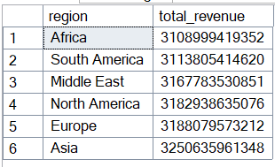

**Insight:**  Asia generates the highest BMW revenue, indicating it’s the brand’s most profitable market. In contrast, Africa accounts for the smallest share, suggesting opportunities to optimize sales strategy or expand market penetration

```sql
--TOP 10 AUTOMATIC CARS BY HIGHEST TOTAL SALES
SELECT TOP 10 Year, SUM(Sales_Volume) AS Total_sold
FROM BMW_sales_dataset
WHERE Transmission = 'Automatic'
GROUP BY Year
ORDER BY SUM(Sales_Volume) DESC;
```

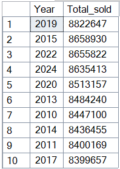

**Insight:**  Automatic cars peaked in sales in 2019, indicating strong consumer preference for automatic transmission that year. This trend can inform production planning and inventory allocation for similar markets.

```sql
-- YEARS WITH THE HIGHEST REVENUE
SELECT TOP 10 Year, SUM(Price_USD * sales_volume) AS total_revenue
FROM BMW_sales_dataset
GROUP BY Year
ORDER BY SUM(Price_USD * sales_volume) DESC;
```

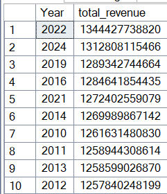

**Insight:** Total revenue peaked in 2022, reflecting strong market performance and possibly the success of new model launches or strategic marketing initiatives that year.

```sql
-- REGION REVENUE % CONTRIBUTION
SELECT region,
ROUND(SUM(price_usd * sales_volume) * 100.0 /
(SELECT SUM(price_usd * sales_volume) FROM BMW_sales_dataset), 2) AS revenue_share_pct
FROM BMW_sales_dataset
GROUP BY region
ORDER BY revenue_share_pct DESC;
```

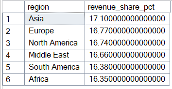

**Insight:**  Asia dominates revenue share, accounting for 17% of total sales, which underscores a bit strong market demand. 

```sql
-- AVERAGE PRICE PER ENGINE SIZE
SELECT
CASE
WHEN ENGINE_SIZE_L < 2.0 THEN 'SMALL ENGINE'
WHEN ENGINE_SIZE_L BETWEEN 2.0 AND 3.0 THEN 'MEDIUM ENGINE'
ELSE 'LARGE ENGINE'
END AS ENGINE_SIZING,
AVG(Price_USD) AS AV_PRICE
FROM BMW_sales_dataset
GROUP BY CASE
WHEN ENGINE_SIZE_L < 2.0 THEN 'SMALL ENGINE'
WHEN ENGINE_SIZE_L BETWEEN 2.0 AND 3.0 THEN 'MEDIUM ENGINE'
ELSE 'LARGE ENGINE'
END
ORDER BY SUM(Price_USD) DESC;
```

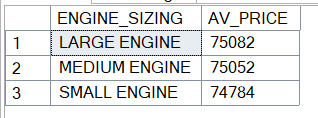

**Insight:**  Average prices across small, medium, and large engine sizes are very similar, suggesting BMW positions its models competitively regardless of engine capacity. This could indicate a strategy to focus on performance or features rather than price differentiation.

```sql
-- TOP 10 REGION AND MODEL SOLD (BY REVENUE)
SELECT TOP 10 region, model,
SUM(Price_USD * sales_volume) AS total_revenue
FROM BMW_sales_dataset
GROUP BY region, model
ORDER BY SUM(Price_USD * sales_volume) DESC;
```

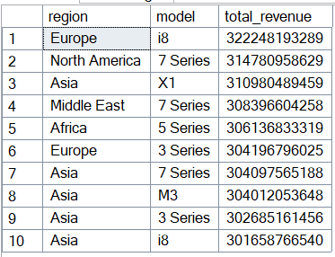

**Insight:**   Europe’s i8, North America’s 7 Series, and Africa’s 5 Series lead revenue in their regions, while Asia shows strong demand across multiple models.

```sql
-- TOP FUEL TYPE BY REGION
SELECT region, fuel_type
FROM (
SELECT region, fuel_type, SUM(sales_volume) AS total_sales_volume,
RANK() OVER(PARTITION BY region ORDER BY SUM(sales_volume) DESC) AS regional
FROM BMW_sales_dataset
GROUP BY region, fuel_type
) ranked
WHERE regional = 1;
```

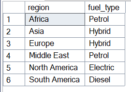

**Insight:**   Fuel preference varies by region:  Africa and the Middle East favor petrol, Europe and Asia lean hybrid, North America prefers electric, and South America sticks with diesel.

```sql
-- TOP 3 BEST SELLING COLORS (BY SALES CLASSIFICATION)
SELECT sales_classification, color
FROM (
SELECT sales_classification, color, SUM(sales_volume) AS total_sold,
RANK() OVER(PARTITION BY sales_classification ORDER BY SUM(sales_volume) DESC) AS color_rank
FROM BMW_sales_dataset
GROUP BY sales_classification, color
) ranked
WHERE color_rank <= 3;
```

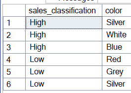

**Insight:**   In the high-sales classification, Silver, White, and Blue dominate, while Low-sales models are mostly Red, Grey, and Silver, showing color preference correlates with sales performance.

```sql
-- TOP COLOUR SOLD EVERY YEAR
SELECT Color, Year, total_revenue
FROM (
SELECT Color, Year,
SUM(Price_USD * sales_volume) AS total_revenue,
RANK() OVER(PARTITION BY Year ORDER BY SUM(sales_volume * price_usd) DESC) AS RANKED_COLOUR
FROM BMW_sales_dataset
GROUP BY Color, Year
) ranks
WHERE RANKED_COLOUR = 1;
```

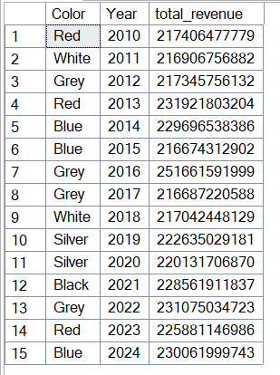

**Insight:**  Grey, Red, and Blue consistently generate high revenue over the years, while Silver and Black peak in specific years, showing color preferences shift but certain colors remain strong performers.

```sql
-- TOP COLOURS SOLD (OVERALL)
SELECT TOP 10 Color, Year,
SUM(Price_USD * sales_volume) AS total_revenue
FROM BMW_sales_dataset
GROUP BY Color, Year
ORDER BY SUM(Price_USD * sales_volume) DESC;
```

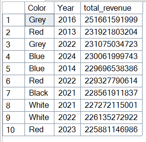

**Insight:**  Grey, Red, and Blue are the top-selling colors overall, with Black and White also performing strongly in select years, indicating consistent consumer preference for neutral and bold tones.

```sql
-- TOP MODEL WITH THE HIGHEST REVENUE PER REGION
SELECT region, model, total_revenue
FROM (
SELECT region, model,
SUM(sales_volume * price_usd) AS total_revenue,
RANK() OVER (PARTITION BY region ORDER BY SUM(sales_volume * price_usd) DESC) AS rank_in_region
FROM BMW_sales_dataset
GROUP BY region, model
) ranked
WHERE rank_in_region = 1;
```

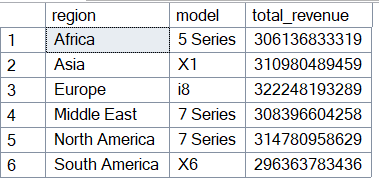

**Insight:**  The **i8 in Europe** is the top revenue-generating model overall, while each region has its own leader: 7 Series in North America and Middle East, X1 in Asia, 5 Series in Africa, and X6 in South America.

```sql
-- MODEL-YEAR MOST SOLD PER REGION
SELECT region, model, Year, TOTAL_SALES
FROM (
SELECT region, model, Year,
SUM(sales_volume) AS TOTAL_SALES,
RANK() OVER(PARTITION BY region ORDER BY SUM(sales_volume) DESC) AS rank_in_region
FROM BMW_sales_dataset
GROUP BY region, model, Year
) ranked
WHERE rank_in_region = 1;
```

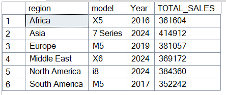

**Insight:**  The most sold model-year, with **7 Series in Asia (2024)** and **i8 in North America (2024)** leading their markets, showing regional and temporal preferences for specific models.

```sql
-- YEAR-OVER-YEAR % REVENUE CHANGE
SELECT year,
SUM(sales_volume) AS total_sales,
LAG(SUM(sales_volume)) OVER(ORDER BY year) AS prev_sales,
ROUND((SUM(sales_volume) - LAG(SUM(sales_volume)) OVER(ORDER BY year)) * 100.0 /
LAG(SUM(sales_volume)) OVER(ORDER BY year), 2) AS yoy_change_pct
FROM BMW_sales_dataset
GROUP BY year
ORDER BY year;
```

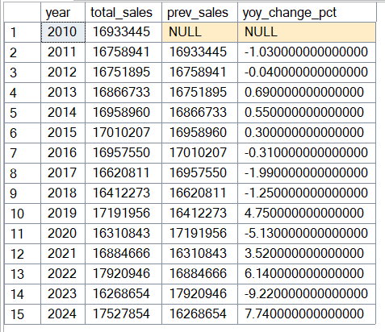

**Insight:**   Revenue fluctuates year-over-year, with notable peaks in 2019, 2022, and 2024, showing periods of strong growth interspersed with declines, highlighting the cyclical nature of BMW sales.

### Recommendations

1. **Focus on High-Revenue Regions:**
    
    Prioritize marketing, distribution, and inventory strategies in **Asia and Europe**, as they consistently generate the highest revenue.
    
2. **Optimize Model Offerings:**
    
    Expand production or promotion of top-performing models like **i8 (Europe)**, **7 Series (North America & Middle East)**, and **X1 (Asia)** to maximize sales.
    
3. **Leverage Color Preferences:**
    
    Maintain stock of consistently popular colors such as **Grey, Red, and Blue**, while tracking emerging color trends in specific years for targeted campaigns.
    
4. **Monitor Fuel Type Demand:**
    
    Adapt regional offerings based on fuel preference trends: hybrid in Europe/Asia, petrol in Africa/Middle East, electric in North America, diesel in South America.
    
5. **Yearly Sales Planning:**
    
    Analyze years with peak revenue (e.g., 2019, 2022, 2024) to replicate successful strategies, and investigate causes of sales dips to mitigate future declines.
    
6. **Pricing & Engine Strategy:**
    
    Since price differences across engine sizes are minimal, focus on highlighting features, performance, and value-added services rather than competing on price alone.
    
7. **Diverse Portfolio for Asia:**
    
    Continue offering a variety of models in Asia, as the market responds well to multiple vehicle types, ensuring broad appeal.
    

To help BMW understand global sales trends and make smarter business decisions, I followed these steps:

1. **Collected the Data:** Compiled worldwide sales data including region, model, year, color, engine size, fuel type, transmission, sales volume, and price.
2. **Cleaned the Data:** Checked for inconsistencies, missing values, and ensured numeric fields like sales and prices were correct.
3. **Explored the Data:** Looked at trends by region, model, year, color, and fuel type to see which combinations drive revenue.
4. **Analyzed the Data:** Used SQL to calculate totals, averages, rankings, and year-over-year changes. For example, I identified top-performing regions, most sold models, and revenue leaders by color and engine type.
5. **Faced Challenges:** Handling a large, multi-dimensional dataset was complex, especially comparing multiple regions, models, and sales years simultaneously.
6. **Generated Insights:** Found that Asia and Europe are the highest revenue regions, i8 and 7 Series are top models in certain markets, petrol is preferred in Africa, hybrids in Europe/Asia, and Grey, Red, and Blue are the most popular colors. Revenue fluctuates year-over-year with clear peaks.
7. **Made Recommendations:** Suggested prioritizing high-revenue regions, promoting top models, keeping popular colors in stock, adapting regional fuel offerings, and using historical sales trends to plan future strategies.
